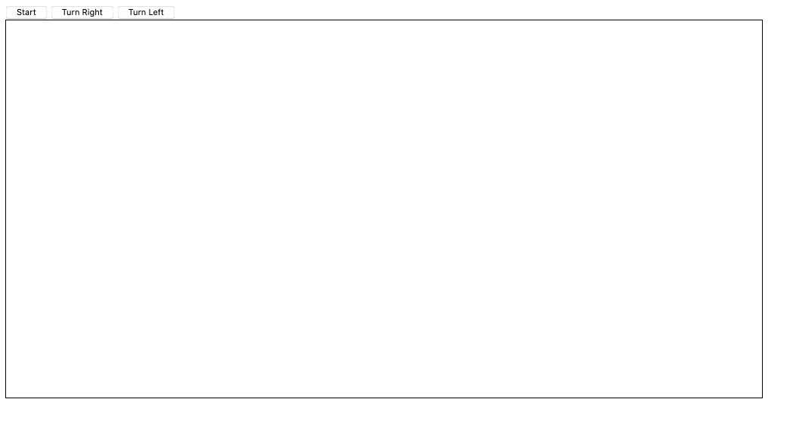
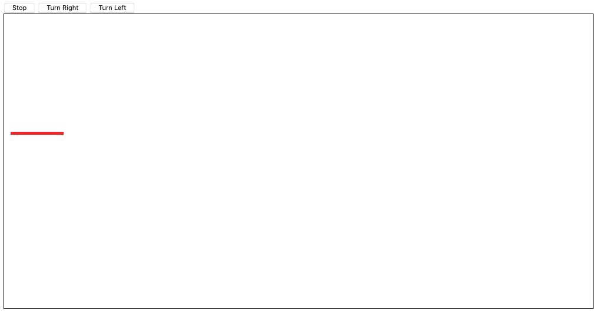
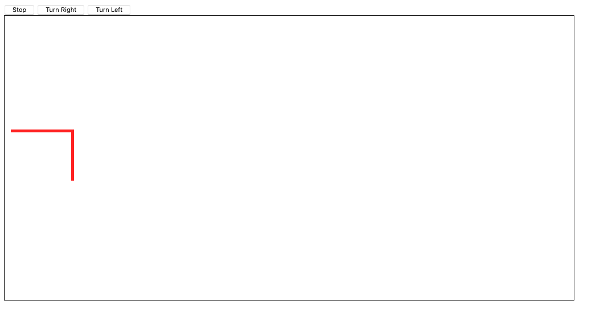
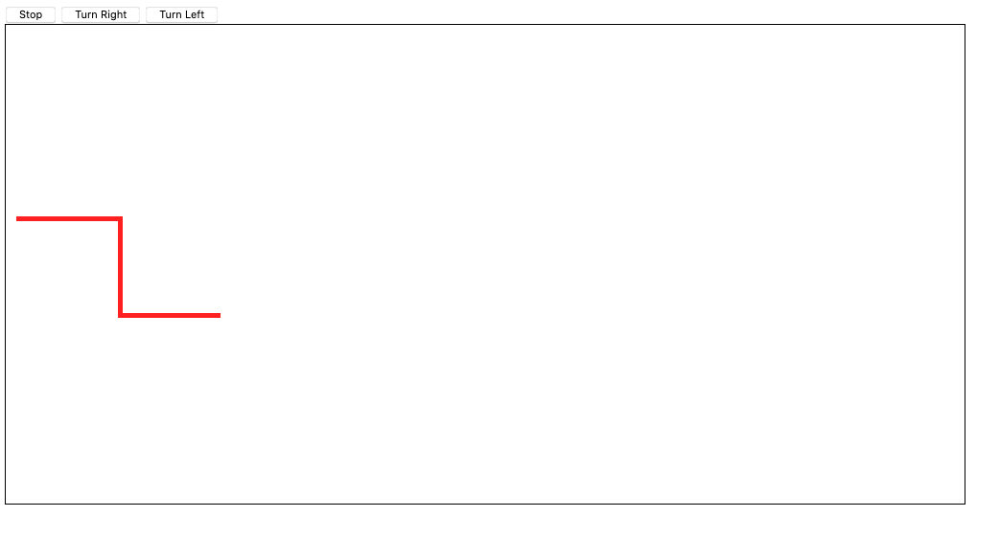
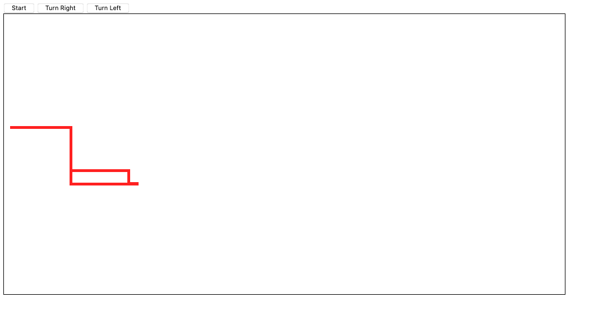
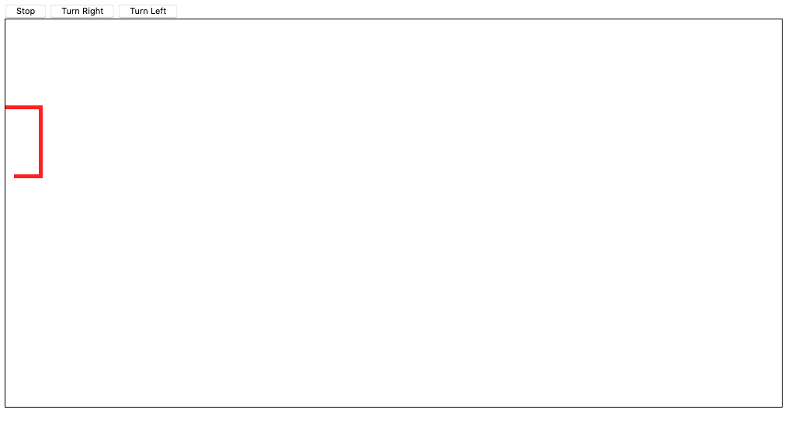
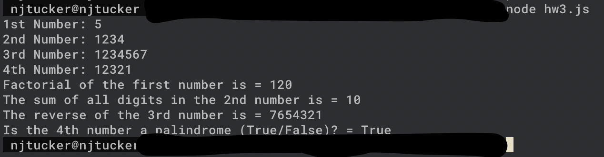

# Homework 3
Submitted by Nathan Tucker (njtucker@iastate.edu)

## To Compile and Run

### Snake

Just open `snake.html` in a browser and you will be able to play the game

### Node Programming

1. Run `npm install`
2. Run `node hw3.js`

## Snake Game

In the html I made a canvas and 3 buttons, one toggled the move and the others toggled the direction.

### function snake()

This is the main game loop and where the bulk of the logic happens. A couple of conditions must first be met in order for the game to run: first, the game must not be over, signified by "end." Then, the character must be moving, which by default is right. If moving, then the direction will affect the x and y accordingly. It will then add the coordinate to a list of visited coordinates. This will be used in the collision detection.

### function turnLeft()

This function determines the direction to change if a left turn is toggled

### function turnRight()

This function determines the direction to change if a right turn is toggled

### function toggleStartStop()

If currently moving, stop. If not moving, start. It also changes the value of the button accordingly. It is stopped and the button is "Start" by default.

### function aboutToCollide() 

Checks for collision. It checks if the head is within the bounds of the canvas and checks if it is about to hit a visited node depending on the direction.

### function containsCoordinate()

Checks to see if the x and y passed in are also contained in the visited list

### Images

## Node JS Programming

### factorial(n) 

Returns the factorial of a number. Recursive call. Basic 227 stuff really.

### sumDigits(num)

Takes the mod 10 value (so the last digit) and adds it to the sum. Then trims off the last digit with a division by 10.

### function reverseString(str)

Takes in a string, splits it into a char array, reverses it, then joins it back together

### function palindrome(str)

Checks for alpha numerc values first with a regular expression, just to allow for spaces in something like "taco cat." Then it reverses the string once all special characters and nonsense have been stripped. If the reverse is the same as the original, it's a palindrome.

### Images

