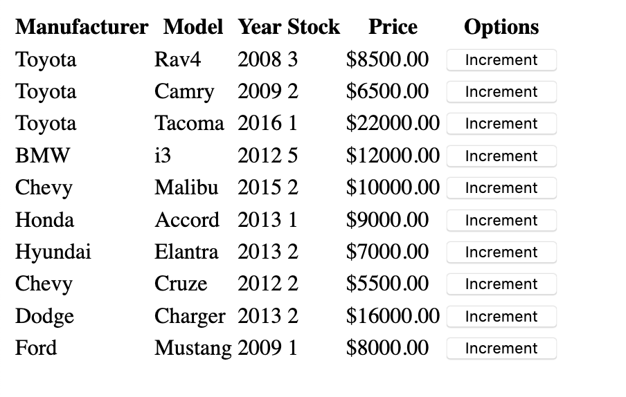
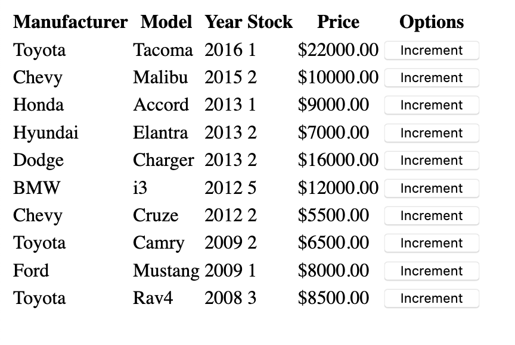
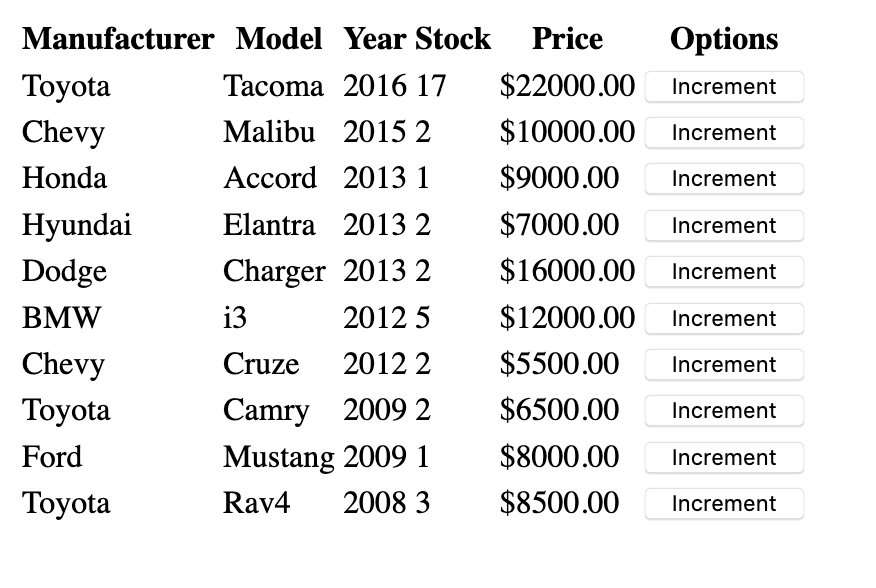

# Homework
Submitted by Nathan Tucker (njtucker@iastate.edu)

## To Compile and View

If using yarn, run

`
yarn build
`

If using npm, run

`
npm run build
`

The build files will be sent to the build/ directory. Open the `index.html` file in a browser to view.

## Explanation

This table is all rendered as a React Component in `Table.js`. I have two states at first, `sort` which is set to ascending by default and the `cars` array.

### incrementValue(car)

This function takes in a `car` object from the `cars` array and increments the stock. Because state is immutable, it makes a copy of the cars and calls `setState({cars: cars})`. This is called when the `Increment` button is clicked with an `onClick`

### toggleSort()

This function simply toggles the sort. If it is state ascending, it sets it to descending and sorts the cars array by comparing the prices. Again, it must call `setState` because it is immutable. If descending, do the opposite.

### renderTableHeader()

Renders the header values of the table. This was abstracted out because gross HTML.

### renderTableData()

This does the rendering of the table data. It works by first mapping all the cars in the cars array to a single car by deconstruction which we can assign to a single table row. Of course there is the addition of the `onClick` on the `Options` column button.

### render()

This brings all the elements together. First by rendering the header, then the table data.

## Screenshots

